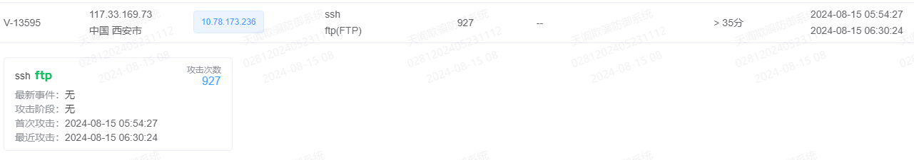
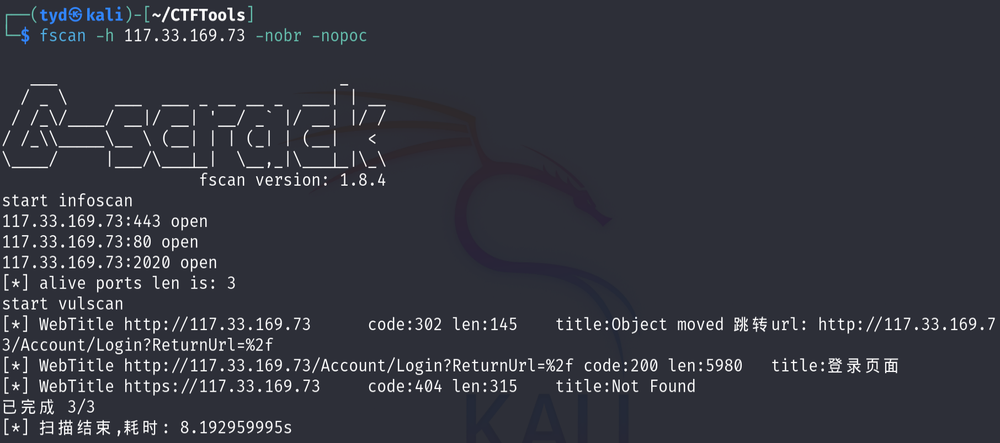
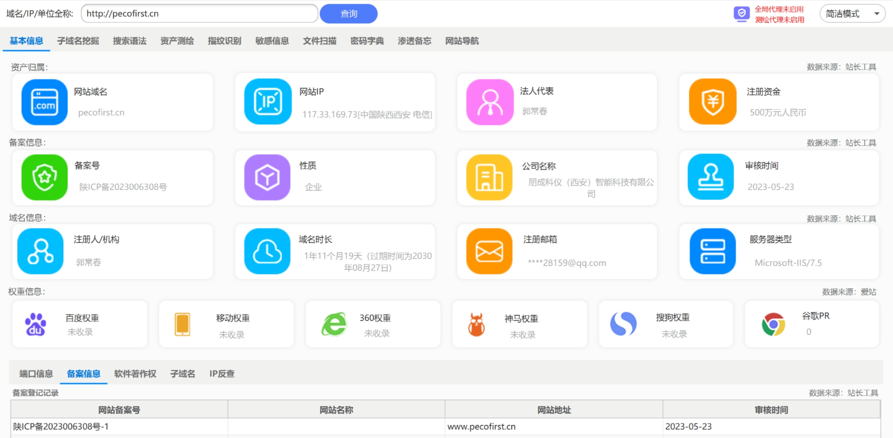
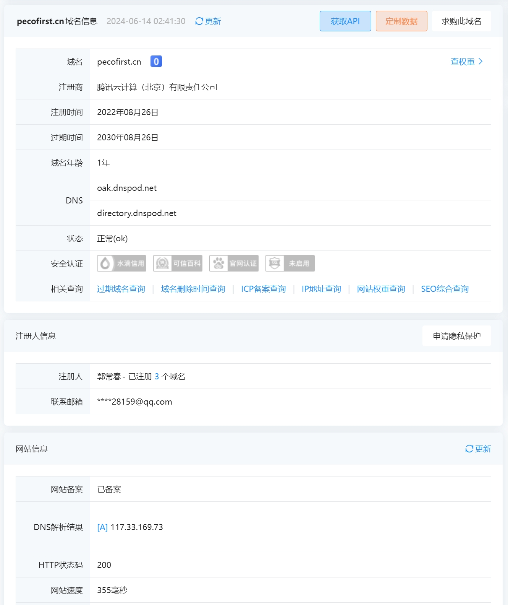
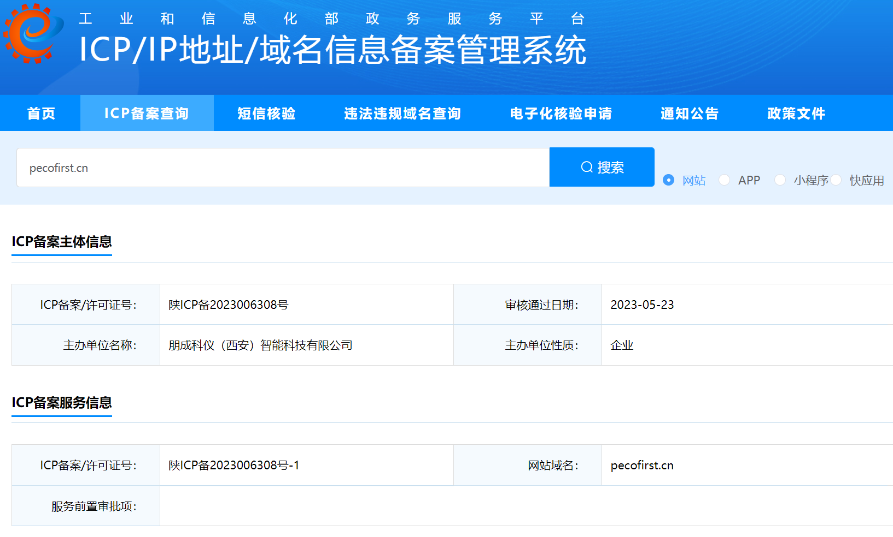
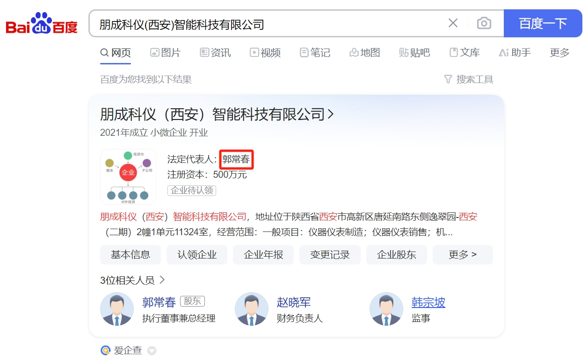

在天阗欺骗防御系统中发现一个来自西安市的 `IP` 在尝试攻击 `ftp` 蜜罐，尝试攻击次数为 `927`，攻击方式为爆破 `ftp` 的用户名和密码。



用 `fscan` 对 `117.33.169.73` 进行扫描，参数为 `-nobr` 和 `-nopoc`。



发现 `117.33.169.73` 存在网页路径  `/Account/Login?ReturnUrl=%2f` ，访问后界面如下：


用 `sqlmap` 尝试 `SQL` 注入未果。

```bash
$ sqlmap -u "http://117.33.169.73/Account/Login?ReturnUrl=%2f/?UserName=1" --current-db
```

使用密探工具发现 `117.33.169.73` 对应域名为 `pecofirst.cn`，并且该域名有网站备案号：**陕ICP备2023006308号**。 



进一步分析发现 `117.33.169.73` 是腾讯云服务器，域名 `pecofirst.cn` 的注册人是 **郭常春**。



查询ICP备案主体信息，发现 **陕ICP备2023006308号** 对应的主办单位是一家企业——朋成科仪（西安）智能科技有限公司。



朋成科仪（西安）智能科技有限公司 的法定代表人就是 **郭常春**，他也是域名 `pecofirst.cn` 的注册人。



当然，不排除这台云服务器是肉鸡或失陷资产的可能。