# OSINT

OSINT的全称是`Open Source Intelligence`，开源网络情报（OSINT）是一种通过公开渠道获取并分析信息的情报收集手段，其定义为“面向特定需求，从公开信息中及时收集、开发和传播的情报”。
常用工具包括但不限于：

- [百度识图](https://graph.baidu.com/pcpage/index)
- [Google](https://www.google.com/)
- [Wikipedia](https://en.wikipedia.org/wiki/Main_Page)
- [Yandex](https://yandex.com/)
- [便民查询网经纬度查询](https://jingweidu.bmcx.com/)
- [Qvdv经纬度查询](https://www.qvdv.net/tools/qvdv-coordinate.html)

## CTFSHOW

在[ctf.show](https://ctf.show/challenges)中，OSINT有一个非常好听的名字——网络迷踪。

### 英语阅读

> 小炫炫最近迷上了OSINT。他说他在某年的考研英语阅读中，曾见到过OSINT，那篇文章中，还提到了他的偶像，你知道他的偶像的名字嘛。
>
> **flag格式ctfshow{Harry_Potter} 注意大小写，空格换下划线。**

关键词是：考研英语阅读，OSINT，偶像。OSINT的英文全称是`Open Source Intelligence`，根据这些关键词搜索，找到原文为2003年考研英语一的阅读理解题，Section Ⅱ Reading Comprehension中Part A部分的Text 1。

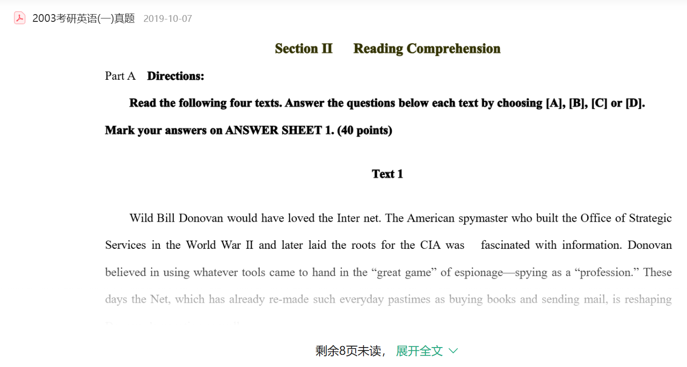

`flag`要求填写偶像名字，文章开头就是——[Bill Donovan](https://en.wikipedia.org/wiki/William_J._Donovan)，OSINT鼻祖，美国中情局创始人。

> Wild Bill Donovan would have loved the Internet. The American spymaster who built the Office of Strategic Services in the World War Ⅱ and later laid the roots for the CIA was fascinated with information.

提交`ctfshow{Bill_Donovan}`即可。

------

### 这是哪里

> 这是一位对当地产生了深远影响的学者，请你找出图中雕像所处位置的经纬度
>
> **flag格式：ctfshow{纬度_经度}（精确到小数点后4位，记得四舍五入哦）。**

关键词是：对当地产生深远影响的学者，雕像。附件提供了一张图片`web.jpg`，用百度搜图，全图搜索不好搜，可以将雕像部分截图进行搜索，搜索出来雕像人物是黄道周先生。继续搜索黄道周雕像，得知地名是福建省漳州市东山黄道周公园。使用[经纬度查询工具](https://jingweidu.bmcx.com/)，得知经度是117.5125，纬度是23.7353。

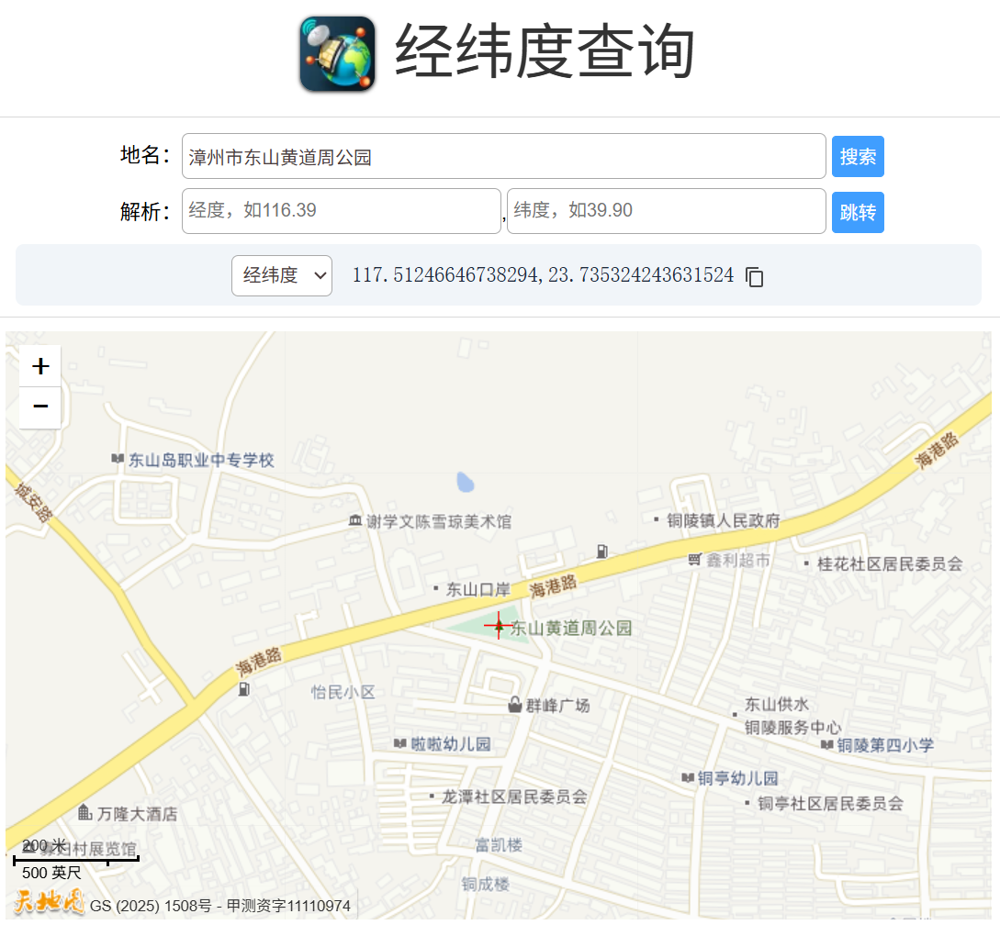

提交`ctfshow{23.7353_117.5125}`即可。

------

### 卡鲁铁盒

> 你能找到这个集装箱的CSC编号与箱生末途吗（港口名字）？
>
> 例：ctfshow{ZBC114514_MIKU}

附件是一张图片`box.jpg`，卡车信息被打马赛克了，与集装箱编号无关联。题目描述中有个关键词：集装箱的CSC编号，即Convention for Safe Containers，国际集装箱安全公约，每个集装箱都有独一无二的号码。使用`Google`搜索图片可以找到[原题](https://geckosint.medium.com/10-beginner-osint-ctf-solutions-ae89e557a4b)。

> **Question 5:** “Our target used this shipping container between 2004–2018. We need to track down most recent CSC number of this container as this will help us log it’s use and key people involved. Can you find the CSC (Convention for Safe Containers) number for this container?”
>
> If you don’t track shipping containers daily, you can Google “container tracker” to reveal container tracking websites within the first few hits. I found the site [track-trace.com](http://www.track-trace.com/) to be helpful in both tracking the container in question and also providing useful resource links. A quick zoom-in to the top right corner of the container reveals the tracking number that needs to be searched: “LGEU4416973”.

根据题目给出的[网址](https://www.track-trace.com/)搜索编号，可以找到港口名字`ROTTERDAM`（注意大写）和CSC编号`FBV854404`。

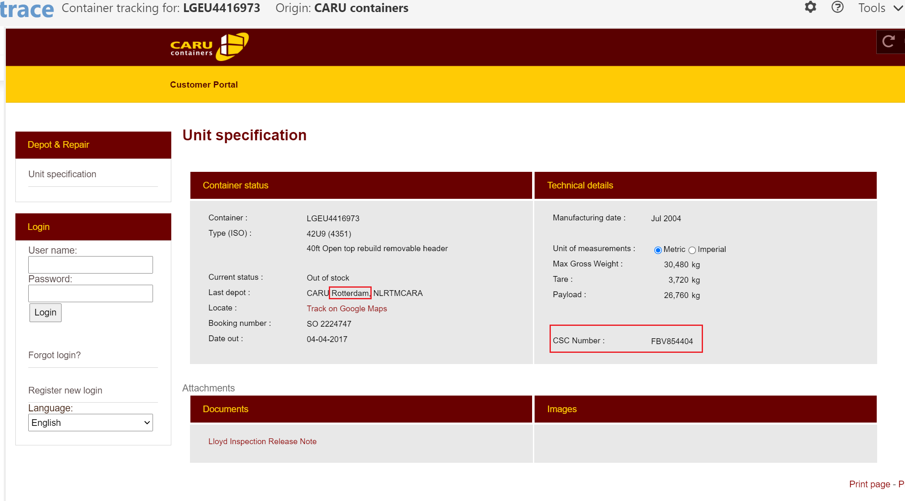

提交`ctfshow{FBV854404_ROTTERDAM}`即可。

------

### 人家想玩嘛

> 拍摄人旁边未拍摄到的 娱乐 项目名称（全大写字母，空格用_代替）
> flag格式：ctfshow{娱乐项目名称-当地该娱乐项目票价-订票增值税} 例：ctfshow{JI_JIAN-11-11%}。

附件`play.zip`解压缩后得到`play.jpg`。打开图片发现建筑物有关键信息“EMAAR”，这是[伊玛尔地产巨头](https://en.wikipedia.org/wiki/Emaar_Properties)，全球第二大地产投资商，以迪拜为总部的房地产上市公司。

[百度识图](https://graph.baidu.com/pcpage/index)得知拍摄位置为“迪拜购物中心喷泉”，英文名为Dubai Mall Fountain，再通过谷歌地图得知，拍摄人旁边未拍摄到的娱乐项目是Dubai Fountain Lake Ride，即`Lake Ride`。

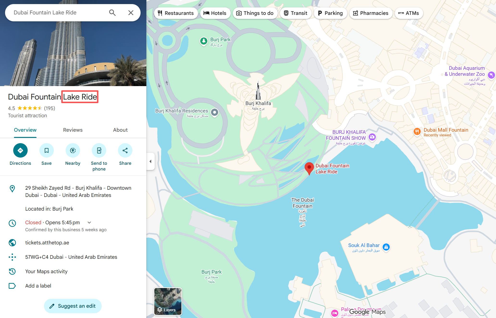

`Google`搜索`Dubai Fountain Lake Ride Ticket Price`，找到票价是每人`65`。

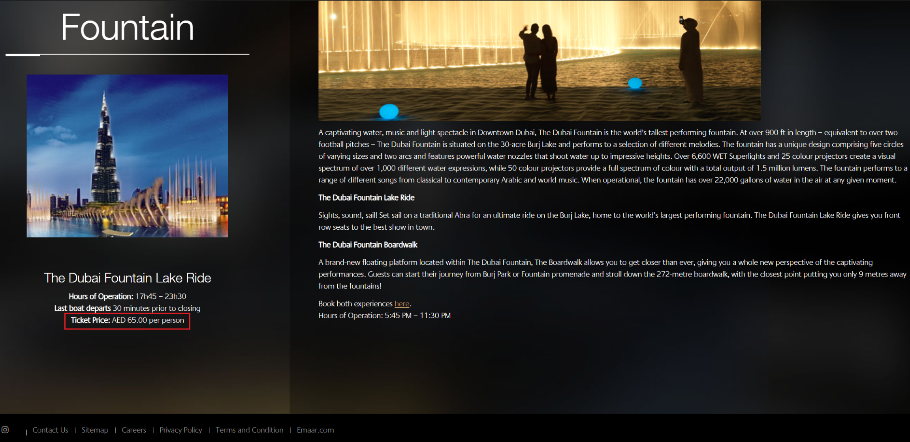

点击网站右边的在线购票，得到当地增值税为`5%`。

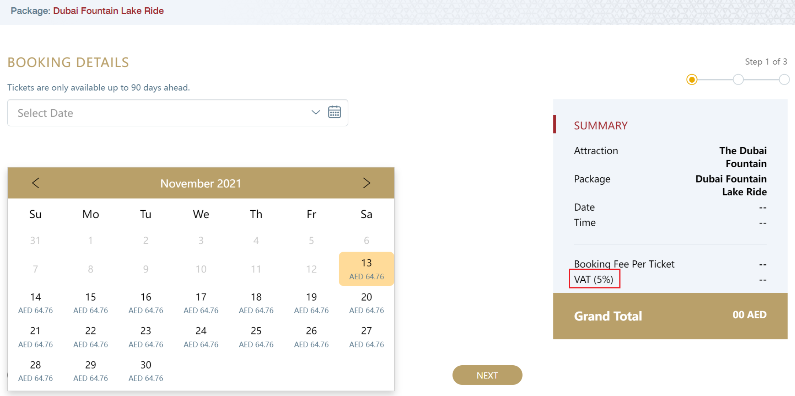

提交`ctfshow{LAKE_RIDE-65-5%}`即可。

------

### 人有点多

> 提交照片上 打码处 的店名（全为大写字母，空格用_代替），店铺联系电话后四位，交通站点详细出口号，最近的停靠线路编号。例：ctfshow{JI_JIAN-1111-3A5-A11}。

下载附件`人有点多.zip`解压缩后得到图片`人有点多.png`。

用百度识图或谷歌识图都可以得出地点名为“涩谷”，英文名为Shibuya，图片中是涩谷的标志性街道。

直接翻译日语或者在谷歌地图查看可以得到店铺名字是`BIC_CAMERA`，在谷歌地图可以看到店铺联系电话号码`+81 3-5466-1111`，后四位是`1111`。

在[BIC_CAMERA官网](https://www.biccamera.com/bc/i/shop/shoplist/shop008.jsp)可以找到线路图，得知最近的地铁路线是“副都心线”，出口号为`B2`。

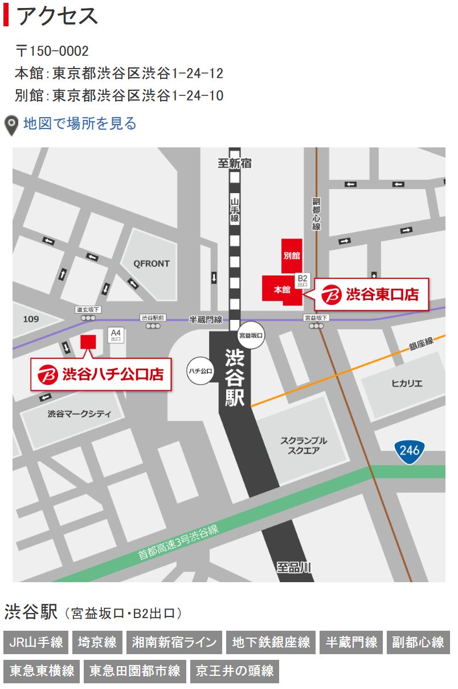

`Google`搜索可以在[Tokyo Metro](https://www.tokyometro.jp/lang_cn/station/shibuya/index.html)中找到“副都心线”在涩谷站的停靠编号为`F16`。

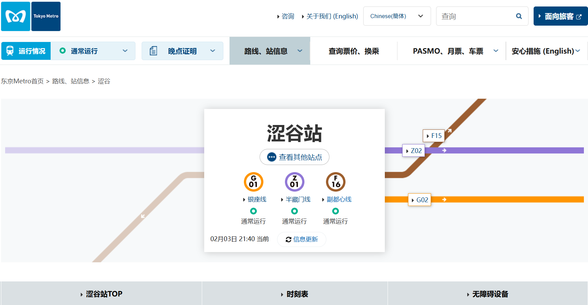

这道题的坑就在于交通站点详细出口号是`10B2`而非`B2`。

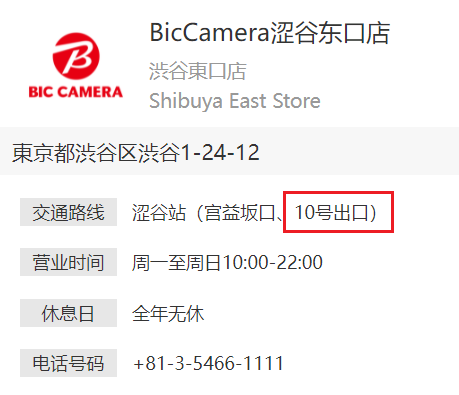

提交`ctfshow{BIC_CAMERA-1111-10B2-F16}`即可。

------

### 小城美食

> 吃饱了才能击剑，找出图中美食所在地址，flag格式：ctfshow{X省X市X区X村X号}。

下载附件图片`food.jpg`，经常刷Bilibili下饭的小伙伴能看出这是B站知名美食区UP主“盗月社食遇记”。

如果不认识也没关系，直接用百度识图，可以在图片来源中找到关键信息：南方100块钱的麻辣烫。

在B站上查看这一期视频[南方100块钱的麻辣烫【精准空降到 06:42】](https://www.bilibili.com/video/BV1oQ4y1D7qj/?share_source=copy_web&vd_source=2818a2f5b4d25f9e164bc71cda9c58f5&t=402)，可以找到店名“然情麻辣烫”。

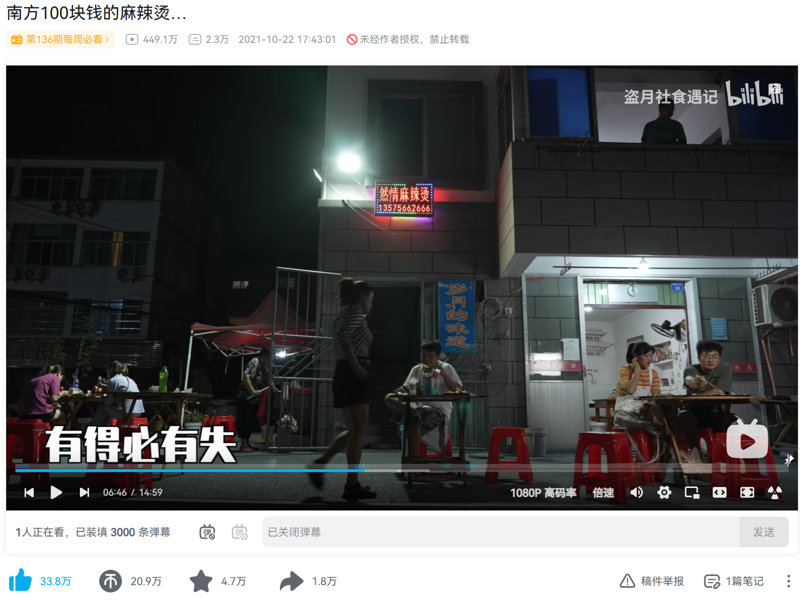

使用高德地图搜索，可以找到这个店铺位于衢州市柯城区龚家埠头村28号，省份是浙江。

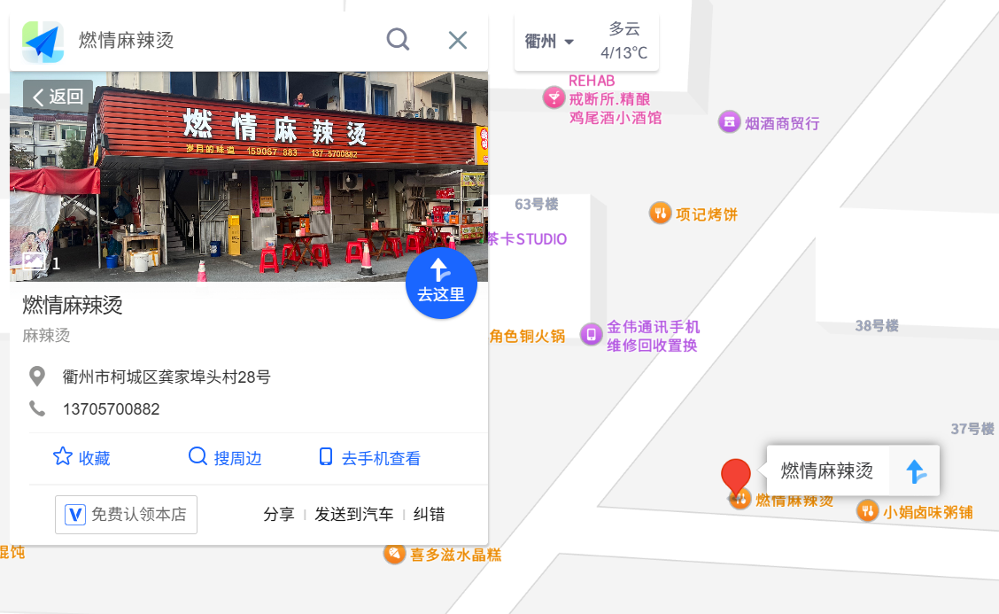

提交`ctfshow{浙江省衢州市柯城区龚家埠头村28号}`即可。

------

### 安装Arch

> 某社团纳新考核的其中一项是安装Arch，现在收到一份作业答案 请找出这份作业（节选）中，截图的bilibili的视频号（BVxxxxx） Example ctfshow{BV1GJ411x7h7}。
>
> PS：来自于真实案例。

附件是一个`PDF`文件`安装Arch.pdf`。根据`PDF`中的几个关键信息：白色字幕，虚拟机，安装arch；在B站搜索`arch`安装，然后通过对比字幕与视频背景快速预览并仔细查看，找到视频`BV1e3411B79M`。

提交`ctfshow{BV1e3411B79M}`即可。

------

### 新手上路

> 提交图片上桥的名字即可，格式ctfshow{桥的名字}。

下载附件图片`1.jpg`，用百度识图或`Google`识图得知地点为蜈支洲岛，Wuzhizhou Island。

使用百度地图实景查看蜈支洲岛，或者直接搜索附近景点，得知是情人桥。

提交`ctfshow{情人桥}`即可。

------

### 初学乍练

> 提交这架飞机的目的地，格式为ctfshow{目的地}。

下载附件图片`2.jpg`，看到一张飞机机翼的图片。根据飞机机翼得知是瑞士国旗，搜索“瑞士有哪些机场”，能得知：瑞士主要的国际机场有苏黎世机场、日内瓦机场和巴塞尔机场、伯尔尼机场等。题目要求输入目的地，尝试输入地名。正确目的地是苏黎世，瑞士第一大城市和最重要的工商业城市。

提交`ctfshow{苏黎世}`即可。

------

### 初学又练

> flag格式为 ctfshow{纬度(精确到小数点后四位, 不用进位)，经度(精确到小数点后四位, 不用进位)}。
>
> 例如 若找到的经纬度为(11.45149,19.19810)，则flag为ctfshow{11.4514,19.1981}。

附件解压缩后得到图片`3.png`，可以看到右边店铺的名字为`Sandwich N Smoothies`。

因为图片中的地点是在国外，所以用`Google`搜索。用谷歌地图查看街景，发现一模一样。

这种经纬度的题恶心就恶心在精确到小数点后四位，红标的店铺经纬度是55.63815, 12.64090。而最后需要提交的值应该是拍摄点所在位置的经纬度，大概是红圈这个位置，经纬度是55.63820, 12.64111。 

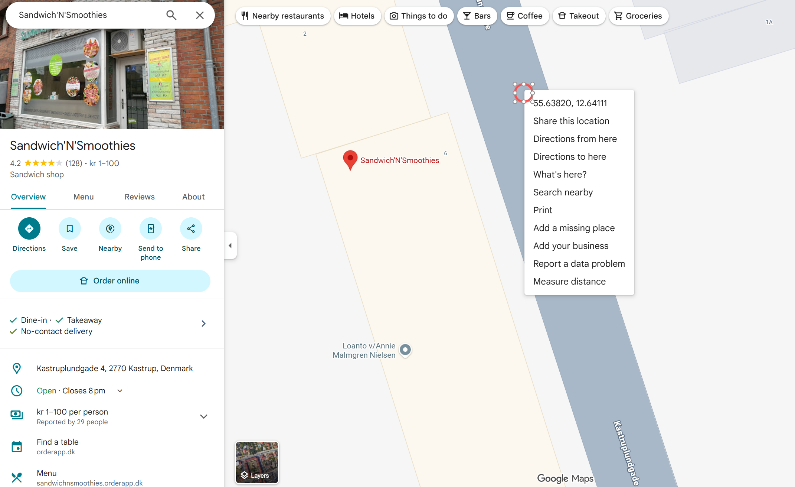

提交`ctfshow{55.6382,12.6411}`即可。

------

### 初学再练

> 提交照片上所在军事基地的名称。
>
> 提交ctfshow{军事基地英文}。

下载附件图片`4.jpg`，使用`Google`识图并补充关键词“military base”，Google的AI Overview如下：

> The image shows a statue of Saint Nicholas located at the Russian Nagurskoye military complex, which is the northernmost military base in the world. 

如果更换关键词为“Nagurskoye”，Google的AI Overview如下：

> Nagurskoye is Russia's northernmost military base and airfield, located on Alexandra Land in the Franz Josef Land archipelago in the Arctic. The statue shown in the image is a monument to Saint Nicholas (Nikolai Chudotvorets) at the base.

题目要求提交照片上所在军事基地的名称，即`Nagurskoye`。

提交`ctfshow{Nagurskoye}`即可。

------

